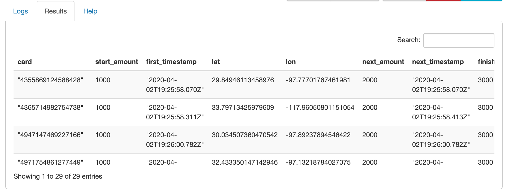

# Fraud
A hypothetical payment authorization flow to demonstrate the Eventador Platform and the use of Continuous SQL to process streaming data.

Authorizations are streamed through Kafka, then they are continuously processed via SQL to find authorizations that are climbing in value over a short time window (our hypothetical fraud). The results are read via REST into a single page javascript application and a heatmap of fraud is generated.

The demo consists of:

- A generator to create hypothetical data
- SQL examples for processing the stream
- Configuration parameters for Eventador Platform
- A single page application to display the data

You will need:

- A kafka provider or your own cluster. The example uses [CC](https://confluent.cloud/login).
- An [Eventador Account](https://eventador.cloud/register).
- Docker installed and working on your machine. If you are new to Docker or just installing it for the first time, [Docker Desktop](https://www.docker.com/products/docker-desktop) might be the easiest route.

## Setup

Open a terminal window and run the following commands from a convenient directory on your machine:

### Clone this repo
```
git clone git@github.com:Eventador/eventador_examples.git
cd eventador_examples/fraud
```

### Create an environment file
In the same directory create an .env file with your login credentials and some configuration information. This example uses Confluent Cloud, if you are using a different Kafka service or your own then specify credentials that match your specific configuration. Replace the variables surrounded by `[ ]` with your own values, including the brackets.
```
echo "BOOTSTRAP_SERVERS=[yourCCkafkaserver:9092]" > fraud.env
echo "SASL_USERNAME=[get from confluent cloud]" >> fraud.env
echo "SASL_PASSWORD=[get from confluent cloud]" >> fraud.env
echo "KAFKA_TOPIC=paymentauths" >> fraud.env
```

### Populate Kafka with data
```
docker build . -t fraud
docker run -d --env-file fraud.env fraud
```

### Setup Eventador
Follow these steps from the Eventador Getting Started Guide.

- Create a [new environment](https://docs.eventador.io/sqlstreambuilder/ssb_getting_started/#1-create-a-cloud-environment). Name it `payment_auths`
- Create a [datasource](https://docs.eventador.io/sqlstreambuilder/ssb_getting_started/#2-create-a-data-source). Name it `payment_auths`. Connect it to the Kafka cluster you configured above.
- Create a new [virtual table source](https://docs.eventador.io/sqlstreambuilder/ssb_getting_started/#3-create-virtual-table-as-a-source). Select `Detect Schema` to create a schema from a sample of the data.

## Create a processing job using Continuous SQL

Follow these steps to run a Continuous SQL job on Eventador.

- Select `SQLStreamBuilder` from the left hand menu.
- Select `results in browser` as the virtual table sink.
- Paste the below SQL into the SQL editor:

```SQL
SELECT *
FROM authorizations
MATCH_RECOGNIZE(
  PARTITION BY card
  ORDER BY eventTimestamp
  MEASURES
      A.amount AS start_amount,
      A.eventTimestamp AS first_timestamp,
      A.lat AS lat,
      A.lon AS lon,
      B.amount AS next_amount,
      B.eventTimestamp AS next_timestamp,
      C.amount AS finish_amount,
      C.eventTimestamp AS finish_timestamp
  ONE ROW PER MATCH
  AFTER MATCH SKIP PAST LAST ROW
  PATTERN (A B C)
  WITHIN INTERVAL '1' MINUTE
  DEFINE
    A AS A.amount IS NOT NULL
      AND CAST(A.amount AS integer) >= 0
      AND CAST(A.amount AS integer) <= 1000,
    B AS B.amount IS NOT NULL
      AND CAST(B.amount AS integer) >= 1001
      AND CAST(B.amount AS integer) <= 2000,
    C AS C.amount IS NOT NULL
      AND CAST(C.amount AS integer) > 2001)
```

- Select the `Materialized View` tab, select `card` as the primary key. Change `retention` to 30 seconds.
- Select `Add Query`, add `auths` as the URL pattern, select `Select All` for the columns, and `Save Changes`.
- Copy the `URL Pattern` by right clicking on it and copying the link address. You will use this in the single page application.
- Select the `SQL` tab, and `Execute` button.


Because the continuous SQL query aggregates and maintains state over a period of time, the query will not return results until the window is complete. When it does, the fraudulent activity is shown as the results arrive. It should look something like this:




## A single page application

Follow these steps to run a single page application that shows a heatmap of fraudulent transactions.

- Edit `client/index.html` and change the constant for URL to the URL you copied above.
- Open `client/index.html` in your browser. It should look something like below:


